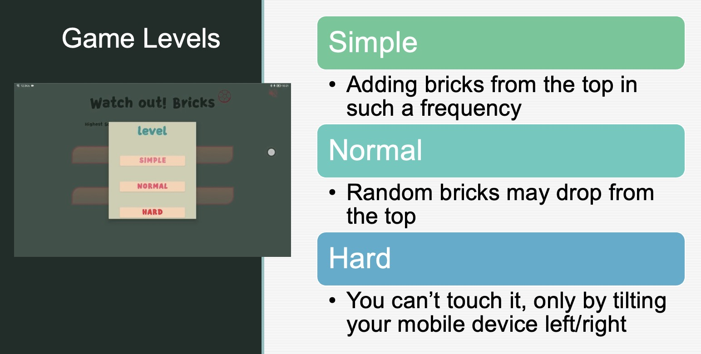
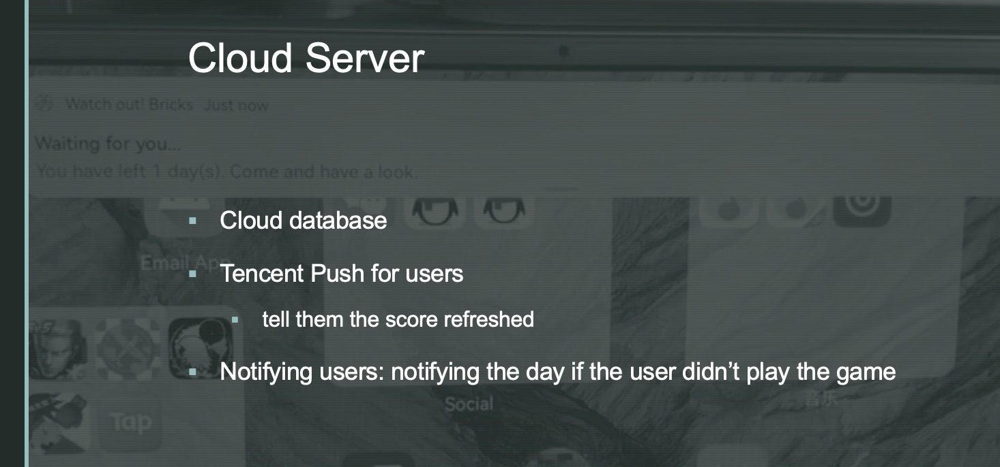
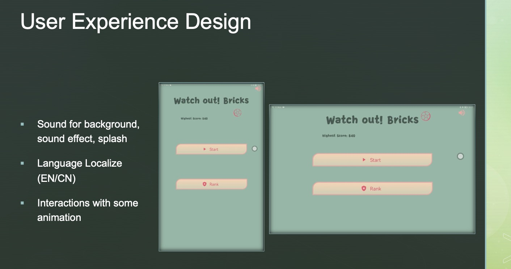

# Android-breakout-game
An old arcade game on Android platform. 
This game has infinite game loop. Additionally, gyroscope sensor is integrated into the game.

Author: Bill-Flash
Date: November 2021

## Game Description and Rules
### Basic Gameplay:
#### **1. Control the Panel:**

The player controls a panel that can move left or right at the bottom of the screen. Your goal is to use the panel to rebound a bouncing ball. The ball will move around the screen, bouncing off walls, bricks, and other surfaces. Important: Don’t let the ball fall below your panel (your baseline). If it does, the game is over.
#### **2. Ball Movement and Physics:**

The ball bounces at the same angle as it hits a surface, similar to how light reflects off a mirror. For example, if the ball hits a wall or brick at a 30-degree angle, it will bounce off at the same 30-degree angle.
The ball’s angle stays constant, but its direction reverses depending on where it hits.
#### **3. Brick Interaction:**

When the ball touches a brick, the brick disappears instantly, and you successfully destroy it.
Bricks are infinite in number, and your score is based on how many bricks you destroy in a single game session.
#### **4. One Life Only:**

The ball has only one life. If it falls below the panel or if bricks reach your baseline, the game ends.
### Additional Gameplay Modes:
#### **1. Falling Bricks Mode:**

Bricks are not stationary. Instead, new bricks are automatically generated at the top of the screen and drop down in rows.
As the rows stack, bricks will slowly move closer to your baseline. The game ends if any brick touches the baseline.

#### **2. Dropping Bricks:**

Occasionally, individual bricks will drop from the air at random locations.
These bricks give a warning signal by shaking before they fall. You must destroy them with the ball before they reach your baseline.
React quickly to deal with these falling bricks to survive longer!

## Features
### Game levels

### Cloud Service 

### User Experience 

